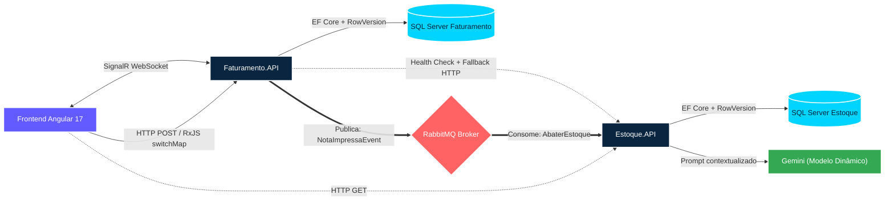

# Korp ERP — Sistema de Faturamento com Microsserviços

Sistema distribuído com dois microsserviços .NET 8, frontend Angular 17, mensageria assíncrona via RabbitMQ, notificações em tempo real via SignalR e análise inteligente de estoque com IA (Gemini RAG).

---

## Arquitetura do Sistema



---

## Estrutura de Pastas

```
solution/
├── Estoque.API/                    # Microsserviço de Estoque
│   ├── Controllers/                # ProdutosController, InsightsController
│   ├── Application/
│   │   ├── DTOs/
│   │   ├── Interfaces/
│   │   └── Services/               # ProdutoService, EstoqueInsightsService (RAG)
│   ├── Domain/
│   │   ├── Entities/               # Produto (domínio rico, sem anemia)
│   │   └── Interfaces/
│   └── Infrastructure/
│       ├── Data/                   # EstoqueDbContext + DesignTimeFactory
│       ├── Migrations/
│       └── Repositories/
│
├── Faturamento.API/                # Microsserviço de Faturamento
│   ├── Controllers/                # NotasFiscaisController
│   ├── Application/
│   │   ├── DTOs/                   # NotaFiscalResponse, ImprimirResponse
│   │   ├── Interfaces/
│   │   └── Services/               # NotaFiscalService (orquestra RabbitMQ + Polly)
│   ├── Domain/
│   │   ├── Entities/               # NotaFiscal, ItemNota (Aberta/Processando/Fechada/Cancelada)
│   │   └── Interfaces/
│   └── Infrastructure/
│       ├── Data/                   # FaturamentoDbContext
│       ├── Hubs/                   # NotaFiscalHub (SignalR)
│       ├── Messaging/              # RabbitMqPublisher, NotaImpressaConsumer, EstoqueHttpClient
│       ├── Migrations/
│       └── Repositories/
│
├── Estoque.Tests/                  # xUnit + Moq — testes de domínio
├── Faturamento.Tests/              # xUnit + Moq — testes de serviço
│
├── frontend/                       # Angular 17
│   └── src/app/
│       ├── shared/                 # ConfirmDialogComponent (modal Angular)
│       └── modules/
│           ├── inventory/          # ProductList + AiInsightsComponent + modais
│           └── invoice/            # InvoiceList com SignalR + RxJS pipeline
│
├── docker/
│   └── docker-compose.yml          # Usa variáveis do .env
├── .env.example                    # Template de variáveis de ambiente
├── .gitignore
├── setup_git.sh                    # Configura GitFlow completo automaticamente
└── .github/workflows/ci.yml        # CI: build + tests + migration validation + docker
```

---

## Como Executar

### Pré-requisitos

| Ferramenta | Versão | Download |
|---|---|---|
| Docker Desktop | 4.x+ | https://www.docker.com/products/docker-desktop |
| .NET SDK | 8.0 | https://dotnet.microsoft.com/download/dotnet/8.0 |
| Node.js | 20.x LTS | https://nodejs.org |
| Angular CLI | 17.x | `npm install -g @angular/cli@17` |

### Configuração inicial (obrigatória)

```bash
# 1. Clone o repositório ou faça download do projeto e extraia os arquivos.
cd solution/

# 2. Crie o .env a partir do exemplo
cp .env.example .env

# 3. Edite o .env com suas variáveis
#    (os valores padrão já funcionam para ambiente local)
```

### Opção A — Docker Compose (recomendado)

```bash
cd docker/
docker-compose --env-file ../.env up -d --build
```

Acesse:
- **Frontend:** http://localhost:4200
- **Estoque.API Swagger:** http://localhost:5001/swagger
- **Faturamento.API Swagger:** http://localhost:5002/swagger
- **RabbitMQ Management:** http://localhost:15672 (guest/guest)

### Opção B — Execução local

```bash
# Terminal 1: Infraestrutura
cd docker/
docker-compose up sqlserver rabbitmq -d

# Terminal 2: Estoque.API
cd Estoque.API/
dotnet run

# Terminal 3: Faturamento.API
cd Faturamento.API/
dotnet run

# Terminal 4: Frontend
cd frontend/
npm install
npm start
```

### Testes

```bash
dotnet test Estoque.Tests/
dotnet test Faturamento.Tests/
```

---

## Configuração de Segredos

### Para Docker (produção)

Preencha o arquivo `.env` na raiz da solution. Nunca faça commit deste arquivo.

```bash
SQLSERVER_SA_PASSWORD=SuaSenhaForte@2024
RABBITMQ_USER=guest
RABBITMQ_PASS=guest
GEMINI_API_KEY=AIza...          # https://aistudio.google.com/app/apikey
```

### Para desenvolvimento local (.NET User Secrets)

```bash
# Estoque.API
cd Estoque.API/
dotnet user-secrets set "ConnectionStrings:DefaultConnection" "Server=localhost,1433;..."
dotnet user-secrets set "AI:GeminiApiKey" "AIza..."

# Faturamento.API
cd Faturamento.API/
dotnet user-secrets set "ConnectionStrings:DefaultConnection" "Server=localhost,1433;..."
```

---

## Decisões Arquiteturais

### Clean Architecture

Cada API segue separação estrita de camadas:

- **Controllers** — recebem HTTP, delegam ao serviço, mapeiam exceções para status codes
- **Application/Services** — orquestram regras de negócio; sem dependência de infraestrutura
- **Domain/Entities** — entidades ricas com comportamento encapsulado (sem domain anemia)
- **Infrastructure** — DbContext, Repositories, RabbitMQ, HTTP clients

### Entidades Ricas (Anti-Anemia de Domínio)

`Produto.AbaterSaldo()` lança exceção se saldo ficaria negativo — a regra vive no objeto de domínio, não no serviço. `NotaFiscal.IniciarProcessamento()` valida que o status é Aberta antes de transicionar.

### Mensageria Assíncrona com RabbitMQ

O fluxo de impressão é completamente assíncrono:

1. `POST /imprimir` → publica `NotaImpressaEvent` na fila `nota.impressa`
2. Nota muda para status `Processando` (intermediário)
3. `NotaImpressaConsumer` (BackgroundService) consome a fila
4. Consumer chama Estoque.API → abate estoque → fecha nota
5. SignalR notifica o frontend em tempo real

### Graceful Degradation (Degradação Graciosa)

Antes de publicar na fila, a Faturamento.API faz um health check rápido no Estoque.API (timeout: 3s):

- **Estoque online:** publica + informa que o processamento ocorrerá em instantes
- **Estoque offline:** publica na fila mesmo assim + informa que o status será atualizado automaticamente quando o serviço se recuperar. A mensagem na fila fica guardada e o consumer retentará com nack + requeue.
- **RabbitMQ offline:** HTTP 503 + nota permanece Aberta + sem alterações no banco

### Resiliência com Polly

O `EstoqueHttpClient` usa dois padrões encadeados:

- **Retry com backoff exponencial:** 3 tentativas (2s, 4s, 8s)
- **Circuit Breaker:** abre após 3 falhas consecutivas, aguarda 30s antes de testar novamente

### Concorrência Otimista e Idempotência

- **`Produto.RowVersion`** — impede que duas notas consumam o mesmo saldo simultaneamente
- **`NotaFiscal.RowVersion`** — impede que duas requisições simultâneas iniciem o processamento da mesma nota (`IniciarProcessamento()` + `DbUpdateConcurrencyException`)
- **Consumer idempotente** — verifica `Status == Fechada` antes de processar; nack + ack correto

### SignalR para Atualizações em Tempo Real

O `NotaFiscalHub` emite `NotaAtualizada` quando o consumer confirma o fechamento. O Angular escuta via `HubConnection` com reconexão automática. Ao receber o evento, atualiza o status inline na tabela e abre o PDF automaticamente.

---

## Ciclos de Vida Angular Utilizados

| Hook | Componente | Uso |
|---|---|---|
| `ngOnInit` | Todos os componentes de lista | Carrega dados iniciais, inicializa formulários e streams RxJS |
| `ngOnDestroy` | Todos os componentes | `Subscription.unsubscribe()` para evitar memory leaks; `HubConnection.stop()` |

---

## RxJS — Operadores Utilizados

| Operador | Onde | Por que |
|---|---|---|
| `switchMap` | `InvoiceListComponent` (impressão) | Cancela requisição anterior se usuário clicar duas vezes |
| `delay` | `InvoiceListComponent` (impressão) | Garante spinner visível por 3s (UX) |
| `catchError` | Stream de impressão | Classifica erros por `status` e `tipo`; retorna `of(null)` para manter stream ativo |
| `tap` | Stream de impressão | Ativa spinner e limpa toast antes da requisição |
| `finalize` | Todos os HTTP calls | Desativa spinner ao terminar (sucesso ou erro) |
| `Subject` | `printSubject$` | Fonte de eventos para o pipeline de impressão |
| `BehaviorSubject` | `notaAtualizada$` (SignalR) | Emite eventos do SignalR para os componentes |

---

## Bibliotecas e Frameworks Utilizados

### Backend (.NET 8)

| Biblioteca | Finalidade |
|---|---|
| Entity Framework Core 8 | ORM, migrations, concorrência otimista via RowVersion |
| Polly + Microsoft.Extensions.Http.Polly | Retry + Circuit Breaker no HTTP client |
| RabbitMQ.Client 6.x | Publicação e consumo de mensagens na fila |
| Microsoft.AspNetCore.SignalR | WebSockets para notificações em tempo real |
| xUnit + Moq | Testes unitários e mocking de dependências |
| Swashbuckle (Swagger) | Documentação interativa das APIs |

### Frontend (Angular 17)

| Biblioteca | Finalidade |
|---|---|
| Angular 17 + RxJS 7 | Framework + programação reativa |
| @microsoft/signalr | Cliente SignalR para receber notificações do backend |
| Angular Reactive Forms | Formulários com validação e FormArray dinâmico |
| Angular Router (lazy loading) | Módulos carregados sob demanda |

---

## Uso de LINQ no C#

| Localização | Uso |
|---|---|
| `NotaFiscalService.CriarAsync` | `GroupBy + Where + Select` para detectar produtos duplicados na nota |
| `NotaFiscalService.ListarAsync` | `OrderByDescending` por número |
| `NotaFiscalService.ImprimirAsync` | `Select` para projetar ItemAbatimentoDto |
| `EstoqueInsightsService` | `Where + OrderBy + Take` para segmentar produtos por status de saldo |
| `ProdutoService.AbaterSaldoLoteAsync` | `GroupBy` para detectar duplicados no lote |
| `NotaFiscal` (domínio) | `Sum()` para calcular ValorTotal dos itens |

---

## Tratamento de Erros e Exceções

### Backend — Hierarquia de Exceções

```
Exception
├── MensageriaIndisponivelException  → HTTP 503 | tipo: MENSAGERIA_INDISPONIVEL
├── EstoqueIndisponivelException     → HTTP 503 | tipo: ESTOQUE_INDISPONIVEL
├── SaldoInsuficienteException       → HTTP 422 | tipo: SALDO_INSUFICIENTE
├── InvalidOperationException        → HTTP 422 | tipo: REGRA_NEGOCIO
├── KeyNotFoundException             → HTTP 404
├── ArgumentException                → HTTP 400
└── DbUpdateConcurrencyException     → HTTP 422 (race condition)
```

O campo `tipo` no JSON de erro permite que o frontend classifique o erro com precisão sem depender de parsing de strings.

### Frontend — Classificação por Status e Tipo

```typescript
if (status === 0)                              → "Servidor indisponível"
if (status === 503 && tipo === 'MENSAGERIA')   → "Falha interna — tente novamente"
if (status === 503 && tipo === 'ESTOQUE')      → "Estoque com lentidão — nota na fila"
if (tipo === 'SALDO_INSUFICIENTE')             → "Saldo insuficiente (concorrência)"
if (tipo === 'REGRA_NEGOCIO' || status === 422)→ "Operação não permitida"
```

---

### Cenário 1 — Estoque.API offline

```bash
# 1. Para o Estoque
docker stop estoque-api

# 2. No Angular, clique "Imprimir" em uma nota Aberta
#    → Spinner visível por 3s
#    → Toast amarelo: "Nota registrada. Estoque com lentidão — será fechada automaticamente"
#    → Nota fica com badge pulsante "Processando"

# 3. Sobe o Estoque novamente
docker start estoque-api

# 4. Consumer processa a fila automaticamente
#    → SignalR notifica o frontend
#    → Badge muda para "Fechada"
#    → Toast verde: "Nota processada com sucesso"
#    → PDF abre automaticamente
```

### Cenário 2 — RabbitMQ offline

```bash
docker stop rabbitmq

# Clique "Imprimir"
# → Toast vermelho: "Falha de comunicação interna. Nota mantida como Aberta por segurança."
# → Zero alterações no banco
```

### Cenário 3 — Concorrência simultânea

```bash
# Dois usuários tentam imprimir a mesma nota ao mesmo tempo
# → Primeiro: sucesso (RowVersion travado)
# → Segundo: HTTP 422 "Esta nota já está sendo processada por outra requisição"
```

---

## Melhorias Futuras — Transactional Outbox Pattern

A implementação atual usa RabbitMQ diretamente no fluxo de impressão. Em sistemas de alta criticidade corporativa, a solução definitiva para garantir que **nenhuma mensagem seja perdida** — mesmo se o RabbitMQ cair entre o commit do banco e a publicação — é o **Transactional Outbox Pattern**:

1. Em vez de publicar diretamente no RabbitMQ, a Faturamento.API grava o evento em uma tabela `OutboxMessages` dentro da **mesma transação** que fecha a nota no banco
2. Um processo separado (Message Relay) lê a tabela e publica no RabbitMQ, marcando o registro como enviado
3. Isso garante atomicidade: se o banco fizer commit, a mensagem será publicada; se não fizer, nada é publicado

Essa abordagem elimina a necessidade do health check e do status `Processando`, pois a consistência é garantida pela transação do banco de dados.

---

## GitFlow

| Branch | Épico |
|---|---|
| `feature/infra-messaging-db` | Epic 1 — Infraestrutura, Banco e RabbitMQ |
| `feature/inventory-service` | Epic 2 — Microsserviço de Estoque |
| `feature/invoicing-service` | Epic 3 — Microsserviço de Faturamento |
| `feature/angular-rxjs-ux` | Epic 4 — Frontend Angular |
| `feature/quality-and-ai` | Epic 5 — Qualidade, IA e Segurança |


---

## Portas e Serviços

| Serviço | Porta |
|---|---|
| Frontend Angular | 4200 |
| Estoque.API + Swagger | 5001 |
| Faturamento.API + Swagger | 5002 |
| SQL Server | 1433 |
| RabbitMQ AMQP | 5672 |
| RabbitMQ Management UI | 15672 |

